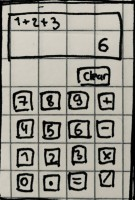

# Online Calculator
A JavaScript (+CSS +HTML) calculator app.

## Learning Goals/The Why of this Project
- anchor the most used object/array methods in JavaScript
- anchor DOM-Manipulation
- RegEx in JavaScript
- styling of buttons in CSS
- subtle animations in CSS

## Specification for the Calculator
- should be able to: add, subtract, multiply and divide
- avoid using eval() as per the MDN recommendation 
- should have buttons for all digits
- should have a display which will be populated depending on user input
- evaluate each pair of numbers at a time, 12 + 7 - 5 * 3 = should yield 42
- round answers with long decimals
- consider problems that can arise if user presses = before entering all operands
- display an error message if user divides by zero
- potentially add a floating point number input

## Project Plan
- [x] figure out the basic button layout  + find a decent color palette (mains #dddddd and #222831, accents #30475e and #f05454)
- [ ] create small function prototypes:
    - a function that takes user string and puts out a modified string (several 0000 get ignored)
    - parse a string as though it's a stack with pop and push methods (Reverse Polish Notation style + Shunting Yard Algorithm)
    - edge case for when there aren't enough operands/operators
    - find a way to deal with very long numbers
- [ ] write out pseudocode 
- [ ] structure the HTML
- [ ] connect the JS to the DOM
- [ ] mobile first CSS, fits the mobile screen, should look like a mobile calculator on desktop as well

